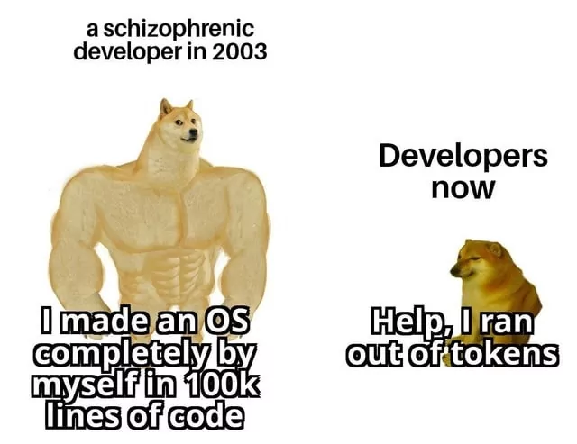

## 👋 Hi, I'm Hongyi

🎓 CS @ Southeast University, School of Computer Science and Engineering  
🔬 Research: Retrieval-Augmented Generation, Agent 

## 🚀 Projects
- 🔗 [PAssistant](https://github.com/Yi-Eaaa/PAssistant) — A personal assistant system based on RAG and LLM memory
- 🔗 [GraphScope](https://github.com/alibaba/GraphScope.git) — A One-Stop Large-Scale Graph Computing System from Alibaba

  
  

## 🧠 Research Interests
- Retrieval-Augmented Generation (RAG)
- Efficient Information Retrieval  
- Multi-agent reinforcement learning

## 📊 GitHub Contributions

  
  
  

## 📫 Contact
- Email: iyhong@foxmail.com
- Wechat: `Yi_Eaaa`